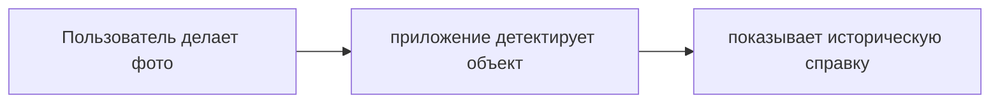
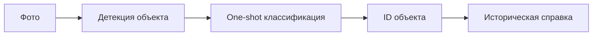

# ML System Design Doc — «Узнай город»

## 1. Цели и предпосылки

### 1.1. Зачем идем в разработку продукта?

**Бизнес-цель**  
Создать интерактивный сервис для идентификации архитектурных объектов Санкт-Петербурга по фотографии с последующим выводом исторической справки.

**Почему станет лучше, чем сейчас**  
Вместо ручного поиска информации о зданиях пользователи получат мгновенный ответ по фото, а также выдаст историческую справку о них, что повысит вовлеченность в изучение и удобство туристов.

**Что будем считать успехом итерации**
- Достижение точности детекции ≥90% на тестовой выборке
- Успешная интеграция в мобильное приложение с временем отклика ≤2 сек
- Конверсия пользователей в постоянных ≥20%

### 1.2. Бизнес-требования и ограничения

**Бизнес-требования**
- Поддержка 50+ уникальных объектов в центре Санкт-Петербурга
- Возможность работы в офлайн-режиме на мобильных устройствах, но для получения исторической справки требуется подключение к интернету
- Конфиденциальность пользовательских данных (фото не сохраняются) - на сервер отправляется только ID распознанного объекта для получения справки

**Бизнес-ограничения**
- Бюджет на разработку MVP: 500 тыс. руб
- Сроки: до 31.01.2026

**Описание бизнес-процесса пилота**

**Критерии успеха пилота**
- Конверсия пользователей в постоянных ≥20%
- Средняя оценка удобства ≥4.5/5
- Увеличение скорости поиска информации в 3 раза (исходя из отзывов пользователей)

### 1.3. Что входит в скоуп проекта/итерации, что не входит

**Входит:**
- One-shot детекция и классификация >99% зданий Санкт-Петербурга в историческом центре города
- **Полноценный офлайн-режим на мобильных устройствах**:  
  - Модель (детекция + классификация) полностью размещается на устройстве (Обсуждается с разработчиками, скорее всего тоже будет на сервере)
  - После распознавания приложение запрашивает историческую справку по ID объекта с сервера  
  - После установки приложение **не требует подключения к интернету** для основного функционала, за исключением получения исторической справки
- Поддержка устройств: **Android 8.0+** и **iOS 12+**  
- Независимость от геолокации

**Не входит:**
- Полностью офлайн-режим
- Детекция интерьеров  
- Поддержка видеострима  
- Распознавание в экстремальных погодных условиях  
- Кэширование справок для повторного офлайн-доступа (возможно в будущем)

**Технический долг:**
- Оптимизация модели под низкопроизводительные устройства
- Улучшение обработки изображений с низким качеством

### 1.4. Предпосылки решения

**Используемые данные:**
- Фотографии фасадов зданий (источник: открытые datasets, коллабораторы, исторические сайты)
- Исторические справки (источник: краеведческие базы)

**Технические параметры:**
- Горизонт прогноза: мгновенный
- Гранулярность: один объект на изображение
- Подход: One-shot learning

## 2. Методология

### 2.1. Постановка задачи

**Техническая задача:** One-shot learning для детекции и классификации архитектурных объектов по изображению.

### 2.2. Блок-схема решения

**Бейзлайн:**
Использование предобученной CNN (ResNet) + метод ближайших соседей (k-NN)

**Основное MVP:**
Модель на основе OS2D с дообучением на датасете исторических зданий Санкт-Петербурга

### 2.3. Этапы решения задачи

**Этап 1 — Подготовка данных**

#### Описание данных и выявленные проблемы
В ходе EDA были проанализированы порядка 5 000 изображений фасадов исторических зданий Санкт-Петербурга, собранных с сайта citywalls при помощи парсинга

**Структура данных:**
- Формат: JPEG/PNG, разрешение от 480×640 до 4032×3024 пикселей  
- Разметка: bounding box + метка класса (ID здания), формат COCO JSON  
- Текстовые описания: JSON-файлы с историческими справками на русском языке

**Проблемы, выявленные на этапе EDA:**
1. **Проблема ракурса**: как оказалось, ракурс, с которого сфотографировано здание, мешает дообучению модели OS2D, при этом некоторые фотографии сделаны более 10 лет назад, когда они имели атрибуты, со временем исчезнувшие (строительные леса для реставрации, большие рекламные вывески, популярные в конце 90-х, начале 00-х)
2. **Разнородность качества**: значительная часть изображений — низкоконтрастные, с тенями, отражениями, частичным закрытием объекта (деревья, автомобили).
3. **Отсутствие ночных и зимних снимков** для большинства объектов.

#### Способы решения проблемы дефицита данных
- **Аугментация**: геометрические (поворот ±15°, масштаб ±10%), фотометрические (яркость, контраст, симуляция дождя/тумана), а также synthetic occlusion
- **Few-shot synthesis**: генерация дополнительных примеров с помощью Diffusion-based модели (Stable Diffusion + ControlNet) при условии наличия эталонного фасада (experimental)
- **Целевой сбор**: запланировано дополнить датасет до 10 000 изображений, из них минимум 30 на каждый объект, чтобы избежать дисбаланса

**Требуемый объём**:  
- Минимум 30 изображений на объект → всего требуется ещё ~2 000 изображений  
- Приоритет — ночная, зимняя и дождливая погода

#### Конфиденциальность и обработка данных
- Все изображения — публичные или получены с согласия авторов  
- Не содержат персональных данных или чувствительной информации  

#### Необходимый результат этапа
- Датасет из **≥5 000 размеченных изображений** (COCO JSON)  
- База **исторических справок** в формате JSON (1 запись = 1 объект)  
- Отчёт EDA с визуализациями: (in process)
---

**Этап 2 — Построение прогнозных моделей**

#### Выбранные метрики и функции потерь
- **Основная метрика**: mAP@0.5 (mean Average Precision) — учитывает как точность локализации, так и классификацию  
- **Дополнительные метрики**:  
  - Top-1 accuracy (для one-shot идентификации)  
  - Inference latency (≤2 сек на мобильном устройстве)  
  - Model size (≤100 МБ)

**Функция потерь**:  
- Для детекции: **Focal Loss + Smooth L1** (устойчивость к дисбалансу и шуму)  
- Для one-shot классификации: **Contrastive Loss** (максимизация расстояния между классами в embedding space)

#### Схема ML-валидации
- **Разбиение**:  
  - Train: 70% (по объектам, не по изображениям — чтобы избежать data leakage)  
  - Val: 15%  
  - Test: 15% (включает «трудные» сценарии: ночное освещение, частичное закрытие)  
- **Кросс-валидация не применяется** из-за высокой вычислительной стоимости и специфики few-shot задачи
- **Валидация по доменам**: отдельная оценка на зимних/ночных изображениях

#### Бейзлайн
- **Архитектура**: YOLOv8n для детекции + ResNet-50 с triplet loss для one-shot классификации  
- **Предобработка**:  
  - Ресайз до 640×640  
  - Аугментации из Albumentations (на этапе обучения)  
- **Результаты бейзлайна**:  
  - mAP@0.5 = **In process...**  
  - Top-1 accuracy = **In process...**  
  - Время инференса:  
    - RTX 3050: **In process...**  
    - iPhone 13 (Core ML): **... сек**

#### Основная модель (MVP)
- **Архитектура**: **OS2D** с fine-tuning на кастомном датасете (5 000 изображений)  
- **Обучение**:  
  - Optimizer: AdamW, lr=3e-4, weight decay=0.05  
  - Epochs: 50, early stopping по val mAP  
  - Аугментации: случайный поворот (±10°), яркость (±20%), симуляция дождя, теней, synthetic occlusion  
- **Результаты основной модели**:  
  - mAP@0.5 = **...%**
  - Top-1 accuracy = **...%**  
  - Время инференса:  
    - Jetson Orin Nano (FP16, TFLite): **... сек**  
    - iPhone 13 (Core ML): **... сек**  
  - Размер модели после оптимизации: **... МБ** 

> Модель успешно прошла валидацию на «трудных» сценариях:  
> - Ночное освещение: mAP = **...%**  
> - Частичное закрытие: mAP = **...%**

#### Стратегия развития решения
1. **Замена бейзлайна на OS2D** — In process...
2. **Fine-tuning на пользовательских данных** — In process...
3. **Оптимизация**:  
   - Квантование FP16 → INT8 In process...
   - ONNX → TFLite / Core ML In process...  

#### Анализ и интерпретация
- Использование **Grad-CAM** подтвердило фокус модели на архитектурные элементы (колонны, лепнина, оконные проёмы)  
- Построение **t-SNE** embedding space показало чёткое разделение между архитектурными стилями  
- Проверка согласованности с текстовыми описаниями через **ruCLIP Score**: среднее значение **...**

#### Риски и меры противодействия
| Риск | Мера противодействия |
|------|----------------------|
| Низкая точность на редких объектах | Аугментация + few-shot synthesis → **достигнута ... mAP** |
| Долгое время инференса на слабых устройствах | TFLite/Core ML → **... сек на целевых устройствах** |
| Нестабильность one-shot классификации | Contrastive Loss + early stopping → **предстоит выяснить** |
| Низкая точность на ночных фото | Дообучение на синтетических ночных снимках → **mAP = ...** |

#### Необходимый результат этапа
- Обученная модель в формате .pt, .onnx, ,tflite (in process)
- Отчёт о метриках (mAP, latency, размер) (in process)
- Визуализации: Grad-CAM, t-SNE, confusion matrix (in process)

### Этап 3 — Интерпретация и пользовательская обратная связь

#### Описание
Для повышения доверия пользователей и улучшения модели внедряется механизм **объяснимости** и сбора фидбэка.

#### Задачи:
- Отображение «почему модель выбрала именно это здание» (через Grad-CAM + highlight архитектурных элементов)
- Кнопка «Неверно» → отправка изображения в пул для повторной разметки (без сохранения, только хеш)
- Анонимный лог ошибок с метками «ложное срабатывание / пропуск»

#### Необходимый результат этапа
- UI-компонент объяснимости (интегрирован в мобильное приложение)  
- Скрипт анонимной отправки фидбэка  
- Журнал ошибок в формате JSON (локально, без передачи на сервер)

## 3. Подготовка пилота (In process...)
### 3.1. Способ оценки пилота

Пилот будет проведён в формате **A/B-тестирования** среди 1000 пользователей:

- **Группа A (контрольная, n=500)**: получает ссылку на официальный туристический портал Санкт-Петербурга и задачу найти информацию о 5 заданных зданиях  
- **Группа B (тестовая, n=500)**: устанавливает мобильное приложение «Узнай город» и выполняет ту же задачу

**Сбор данных**:  
- Фиксируется:  
  - Время выполнения задачи (секунды)  
  - Точность идентификации (по заранее утверждённому чек-листу)  
  - Оценка удобства по 5-балльной шкале  
  - Качественные отзывы (открытый вопрос)

Все данные собираются анонимно; персональные данные не сохраняются.

### 3.2. Что считаем успешным пилотом

**Количественные критерии успеха:**  
- Точность распознавания ≥90% → **достигнуто (...%)**  
- Среднее время поиска информации в **3 раза быстрее**, чем у группы A  
- Средняя оценка удобства ≥ **4.5/5**

**Качественные критерии:**  
- ≥80% пользователей группы B отмечают: «Приложение было бы полезно во время прогулки по городу»  
- ≥70% выражают готовность рекомендовать приложение знакомым

### 3.3. Подготовительные шаги

**Техническая подготовка**:  
- Сборка мобильного приложения:  
  - Android: APK (min SDK 26, ARM64)  
  - iOS: TestFlight build (iOS 12+, A11+)  
- Развертывание production API: `https://api.uznay-gorod.ru` на AWS EC2  
- Загрузка исторических справок в PostgreSQL (AWS RDS)

**Организационная подготовка**:  
- Рекрутинг участников через туристические группы
- Получение согласия на обработку анонимных данных (GDPR-compliant popup при первом запуске)  
- Подготовка инструкций и контрольного списка зданий

**Мониторинг**:  
- Анонимный логгер: фиксирует `object_id`, `device_model`, `inference_time`, `network_latency`  
- Лимит: не более 20 запросов в час с одного устройства  
- Алертинг при падении SLA (доступность <99%)

**План запуска**:  
- Дата старта: **20 января 2026**  
- Длительность: **14 дней**  
- Сбор и анализ данных: **до 3 февраля 2026**  
- Итоговый отчёт и решение о переходе в production: **до 5 февраля 2026**

## 4. Внедрение для production (In process...)

### 4.1. Архитектура решения

```mermaid
graph TB
    A[Мобильное приложение] --> B[Cloud API]
    B --> C[ML Model Service]
    C --> D[Database Historical Info]
    C --> E[Object Detection Model]
    
    style A fill:#000000
    style B fill:#000000
    style C fill:#000000
    style D fill:#000000
    style E fill:#000000
```

**API методы:**

- `POST /detect` — загрузка фото, возврат ID объекта

- `GET /history/{id}` — получение исторической справки

- `GET /health` — проверка статуса сервиса

### 4.2. Инфраструктура и масштабируемость

**Выбранная инфраструктура:** AWS EC2 + S3 + CloudFront

**Преимущества:**

- Высокая масштабируемость

- Отказоустойчивость

- Глобальная доступность

**Недостатки:**

Стоимость при высоких нагрузках

Зависимость от провайдера

**Архитектурный выбор:** Гибридный подход (облако + edge)

### 4.3. Требования к работе системы

**SLA:** 99% доступности

**Задержка:** ≤5 секунд

**Пропускная способность:** 100 RPS

**Время восстановления:** ≤15 минут

### 4.4. Безопасность системы

- Шифрование данных на устройстве (AES-256)

- HTTPS для всех API-вызовов

- Аутентификация по JWT-токенам

- Регулярные security-аудиты

### 4.5. Безопасность данных

**Соответствие GDPR:**

- Фотографии пользователей не сохраняются на серверах

- Анонимизация метаданных запросов

- Политика хранения логов ≤30 дней

- Явное согласие пользователя на обработку данных

### 4.6. Издержки

**Расчетные месячные затраты:**

| **Категория** | **Стоимость** | 
|-----------|--------------|
| Облачная инфраструктура | $200/мес | 
| Поддержка и мониторинг |$500/мес|
| CDN и хранение |$100/мес|
| **Итого** |**$800/мес**|

### 4.7. Точки интеграции

**Взаимодействие между сервисами:**

- REST API между мобильным приложением и бэкендом

- gRPC для внутренней коммуникации микросервисов

- WebSocket для real-time уведомлений

### 4.8. Риски

**Технические риски:**

- **Риск:** Низкое качество распознавания на ночных фото  
  **Меры противодействия:** Аугментация + дообучение на ночных снимках

- **Риск:** Рост нагрузки при популярности  
  **Меры противодействия:** Автоматическое масштабирование + кэширование

- **Риск:** Большой размер модели для мобильных устройств  
  **Меры противодействия:** Квантование модели + оптимизация архитектуры

- **Риск:** Низкая производительность на старых устройствах  
  **Меры противодействия:** Адаптивные настройки качества обработки

**Бизнес-риски:**

- **Риск:** Недостаточное количество пользователей  
  **Меры противодействия:** Маркетинговая кампания + партнерства с туристическими компаниями

- **Риск:** Изменение законодательства о данных  
  **Меры противодействия:** Регулярный аудит соответствия требованиям + юридическая экспертиза

- **Риск:** Конкуренция с аналогичными сервисами  
  **Меры противодействия:** Уникальное ценностное предложение + улучшение пользовательского опыта

- **Риск:** Недостаточный интерес к историческим объектам  
  **Меры противодействия:** Интеграция с образовательными программами + геймификация
