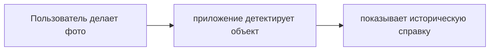
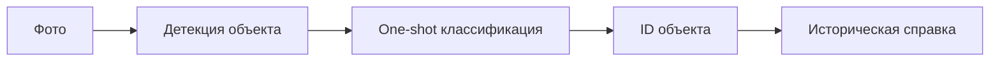

# ML System Design Doc — «Узнай город»

## 1. Цели и предпосылки

### 1.1. Зачем идем в разработку продукта?

**Бизнес-цель**  
Создать интерактивный сервис для идентификации архитектурных объектов Санкт-Петербурга по фотографии с последующим выводом исторической справки.

**Почему станет лучше, чем сейчас**  
Вместо ручного поиска информации о зданиях пользователи получат мгновенный ответ по фото, а также выдаст историческую справку о них, что повысит вовлеченность в изучение и удобство туристов.

**Что будем считать успехом итерации**
- Достижение точности детекции ≥90% на тестовой выборке
- Успешная интеграция в мобильное приложение с временем отклика ≤2 сек
- Конверсия пользователей в постоянных ≥20%

### 1.2. Бизнес-требования и ограничения

**Бизнес-требования**
- Поддержка 50+ уникальных объектов в центре Санкт-Петербурга
- Возможность работы в офлайн-режиме на мобильных устройствах
- Конфиденциальность пользовательских данных (фото не сохраняются)

**Бизнес-ограничения**
- Бюджет на разработку MVP: 500 тыс. руб
- Сроки: до 31.01.2026

**Описание бизнес-процесса пилота**

**Критерии успеха пилота**
- Конверсия пользователей в постоянных ≥20%
- Средняя оценка удобства ≥4.5/5
- Увеличение скорости поиска информации в 3 раза (исходя из отзывов пользователей)

### 1.3. Что входит в скоуп проекта/итерации, что не входит

**Входит:**
- One-shot детекция >99% зданий Санкт-Петербурга в историческом центре города
- Мобильное приложение (Android/iOS)
- Независимость от геолокации

**Не входит:**
- Детекция интерьеров
- Поддержка видеострима
- Распознавание объектов в плохих погодных условиях

**Технический долг:**
- Оптимизация модели под низкопроизводительные устройства
- Улучшение обработки изображений с низким качеством

### 1.4. Предпосылки решения

**Используемые данные:**
- Фотографии фасадов зданий (источник: открытые datasets, коллабораторы, исторические сайты)
- Исторические справки (источник: краеведческие базы)

**Технические параметры:**
- Горизонт прогноза: мгновенный
- Гранулярность: один объект на изображение
- Подход: One-shot learning

## 2. Методология

### 2.1. Постановка задачи

**Техническая задача:** One-shot learning для детекции и классификации архитектурных объектов по изображению.

### 2.2. Блок-схема решения

**Бейзлайн:**
Использование предобученной CNN (ResNet) + метод ближайших соседей (k-NN)

**Основное MVP:**
Модель на основе OS2D с дообучением на датасете исторических зданий Санкт-Петербурга

### 2.3. Этапы решения задачи
**Этап 1 — Подготовка данных**

| Данные | Источник | Ресурсы | Качество |
|:---:|:---:|:---:|:---:|
| Фотографии фасадов | Датасеты, коллабораторы | Data Engineer | + |
| Разметка | Ручная разметка + аугментация | Data Scientist | + |
| Исторические справки | Краеведческие базы | Product Owner | + |

**Результат:**

- Датасет из 5 000 размеченных изображений
- Аугментированные данные (повороты, освещение, погодные условия)
- База исторических справок для каждого объекта

**Этап 2 — Построение прогнозных моделей**

**Бейзлайн:**
- Архитектура: ResNet-50 + k-NN
- Метрика: Accuracy ≥70%
- Время инференса: ≤1.5 сек

**MVP:**
- Архитектура: OS2D с fine-tuning
- Метрика: mAP ≥90%
- Время инференса: ≤5 сек
  
**Риски:**
- Малое количество примеров для редких зданий
- **Меры противодействия**: аугментация + few-shot техники

**Этап 3 — Интерпретация моделей**

- Построение важных метрик для оценки качества модели

- Анализ важности архитектурных элементов, способности анализировать уникальные архитектурные элементы

- Проверка сопоставления изображений с текстовой информацией о них

**Этап 4 — Интеграция в приложение**

- Разработка мобильного клиента (React Native)

- Реализация API для доступа к LLM при получении текстового описания

- Тестирование на различных устройствах - смартфонах Android и iPhone

## 3. Подготовка пилота (In process...)
### 3.1. Способ оценки пилота

**A/B тестирование:**

- Группа A: традиционный ручной поиск информации

- Группа B: использование мобильного приложения

**Метрики оценки:**

- Время поиска информации

- Удовлетворенность пользователей

- Количество успешных распознаваний

### 3.2. Что считаем успешным пилотом

**Количественные метрики:**

- Увеличение скорости поиска информации в 3 раза

- Удовлетворенность пользователей ≥4.5/5

- Точность распознавания ≥90%

**Качественные показатели:**

- Положительные отзывы пользователей

- Готовность рекомендовать приложение

### 3.3. Подготовка пилота
**Технические ограничения:**

- Размер модели: ≤100 МБ

- Поддержка Android 8.0+ и iOS 12+

**План запуска:**

- Запуск на 1000 пользователей

- Сбор обратной связи в течение 2 недель

- Анализ метрик, обратной связи и доработка

## 4. Внедрение для production (In process...)

### 4.1. Архитектура решения

```mermaid
graph TB
    A[Мобильное приложение] --> B[Cloud API]
    B --> C[ML Model Service]
    C --> D[Database Historical Info]
    C --> E[Object Detection Model]
    
    style A fill:#000000
    style B fill:#000000
    style C fill:#000000
    style D fill:#000000
    style E fill:#000000
```

**API методы:**

- `POST /detect` — загрузка фото, возврат ID объекта

- `GET /history/{id}` — получение исторической справки

- `GET /health` — проверка статуса сервиса

### 4.2. Инфраструктура и масштабируемость

**Выбранная инфраструктура:** AWS EC2 + S3 + CloudFront

**Преимущества:**

- Высокая масштабируемость

- Отказоустойчивость

- Глобальная доступность

**Недостатки:**

Стоимость при высоких нагрузках

Зависимость от провайдера

**Архитектурный выбор:** Гибридный подход (облако + edge)

### 4.3. Требования к работе системы

**SLA:** 99% доступности

**Задержка:** ≤5 секунд

**Пропускная способность:** 100 RPS

**Время восстановления:** ≤15 минут

### 4.4. Безопасность системы

- Шифрование данных на устройстве (AES-256)

- HTTPS для всех API-вызовов

- Аутентификация по JWT-токенам

- Регулярные security-аудиты

### 4.5. Безопасность данных

**Соответствие GDPR:**

- Фотографии пользователей не сохраняются на серверах

- Анонимизация метаданных запросов

- Политика хранения логов ≤30 дней

- Явное согласие пользователя на обработку данных

### 4.6. Издержки

**Расчетные месячные затраты:**

| **Категория** | **Стоимость** | 
|-----------|--------------|
| Облачная инфраструктура | $200/мес | 
| Поддержка и мониторинг |$500/мес|
| CDN и хранение |$100/мес|
| **Итого** |**$800/мес**|

### 4.7. Точки интеграции

**Взаимодействие между сервисами:**

- REST API между мобильным приложением и бэкендом

- gRPC для внутренней коммуникации микросервисов

- WebSocket для real-time уведомлений

### 4.8. Риски

**Технические риски:**

- **Риск:** Низкое качество распознавания на ночных фото  
  **Меры противодействия:** Аугментация + дообучение на ночных снимках

- **Риск:** Рост нагрузки при популярности  
  **Меры противодействия:** Автоматическое масштабирование + кэширование

- **Риск:** Большой размер модели для мобильных устройств  
  **Меры противодействия:** Квантование модели + оптимизация архитектуры

- **Риск:** Низкая производительность на старых устройствах  
  **Меры противодействия:** Адаптивные настройки качества обработки

**Бизнес-риски:**

- **Риск:** Недостаточное количество пользователей  
  **Меры противодействия:** Маркетинговая кампания + партнерства с туристическими компаниями

- **Риск:** Изменение законодательства о данных  
  **Меры противодействия:** Регулярный аудит соответствия требованиям + юридическая экспертиза

- **Риск:** Конкуренция с аналогичными сервисами  
  **Меры противодействия:** Уникальное ценностное предложение + улучшение пользовательского опыта

- **Риск:** Недостаточный интерес к историческим объектам  
  **Меры противодействия:** Интеграция с образовательными программами + геймификация
